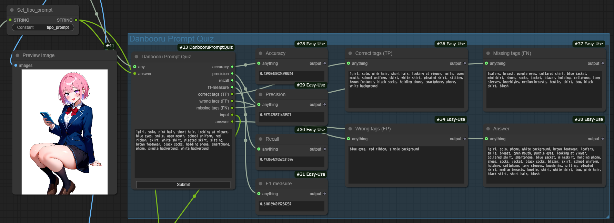

# DanbooruPromptQuiz
  

- [TIPO](https://github.com/KohakuBlueleaf/z-tipo-extension)や[Tagger](https://github.com/pythongosssss/ComfyUI-WD14-Tagger)などで出力されたプロンプトから生成された画像を見てプロンプトを推測するゲームをするためのノードです。
- 推測したプロンプトとTIPOやTaggerなどで出力されたプロンプトのタグを比較し、以下を出力します。
  - 正解率
  - 適合率
  - 再現率
  - F値
  - 正解したタグ (True Positive)
  - 誤って推測したタグ (False Positive)
  - 推測されていないタグ (False Negative)

## 使い方
- TIPOやTaggerなどでプロンプトを生成します。
- そのプロンプトをもとに画像を生成します。
- 生成された画像を見ながら、answerに入力されたプロンプトを推測し、inputに入力します。
- 「Submit」ボタンを押すと、正解率や正解したタグなどが出力されます。
